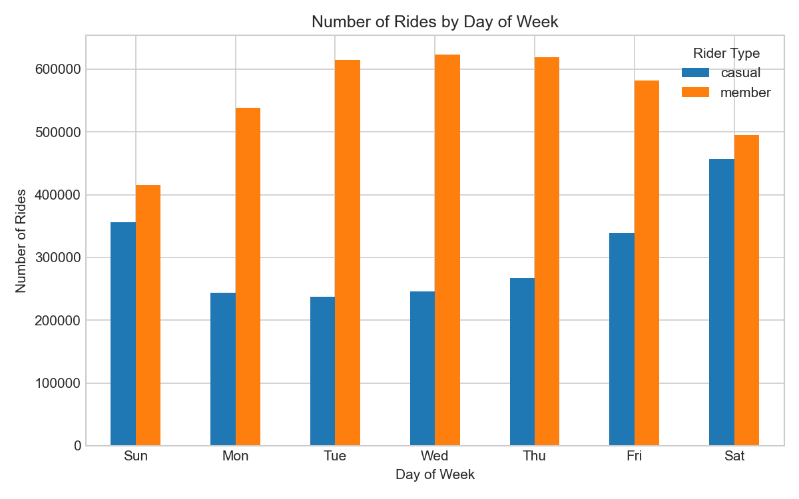
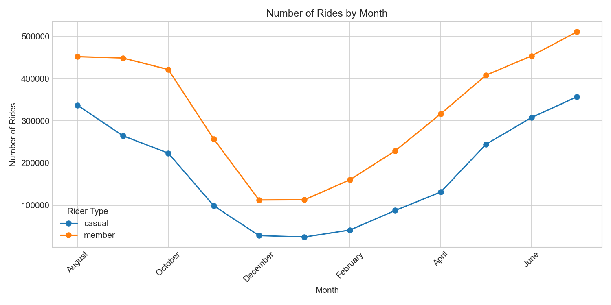

# Cyclistic Bike-Share Case Study

**Google Data Analytics Certification Capstone**

How do annual members and casual riders use Cyclistic (Divvy) bikes differently? This project analyzes 12 months of historical trip data (6.03M rides) to uncover behavioral differences between rider types, in order to inform a marketing strategy aimed at converting casual riders into annual members.

## Business Task

Cyclistic's director of marketing believes future growth depends on converting casual riders into annual members, since members are more profitable. This analysis answers the first of three guiding questions the marketing team needs to design that strategy: **how do annual members and casual riders use Cyclistic bikes differently?**

## Data Source

12 months of Divvy trip data (Aug 2025 – Jul 2026), made available by Motivate International Inc. under public license. 6,032,570 ride records (2,146,699 casual / 3,885,871 member) with timestamps, station info, bike type, and rider type (`member` / `casual`).

## Tools Used

- **Python** (pandas, matplotlib) — data cleaning, transformation, analysis, and visualization
- **Jupyter Notebook** — see [`cyclistic_analysis.ipynb`](./cyclistic_analysis.ipynb) for the full workflow, including inline documentation of every step

## Data Cleaning Summary

- Merged 12 monthly CSVs after verifying matching schemas
- Created `ride_length` (minutes) and `day_of_week` (Sunday = 1, per case study convention)
- Removed rides with zero/negative duration and rides over 24 hours (likely docking errors)
- Removed duplicate `ride_id`s
- Full documented cleaning trail is in the notebook

## Key Findings

- **Ride duration:** Casual riders average **18.26 minutes** per ride (median 11.03) vs. **12.01 minutes** for members (median 8.57) — casual rides run **52% longer** on average.
- **Weekly pattern:** Members peak Tuesday–Wednesday (~614K–623K rides/day) and dip on Sunday (415K) — a commuting pattern. Casual riders peak Saturday (456K) and are lowest midweek on Tuesday (238K) — a leisure pattern.
- **Seasonality:** Casual ridership falls **93%** from its July peak (357K rides) to its January low (25K). Member ridership falls less sharply — **78%** from July (511K) to its December low (112K). Casual riders are far more weather-sensitive, and their low point lags a month behind members' (January vs. December).
- **Bike type:** Electric bikes see far more total use than classic bikes (4.15M vs. 1.89M rides). Casual riders make up a larger share of electric bike rides (**37.1%**) than classic bike rides (**32.2%**) — a mild preference for electric among casual users.

## Top 3 Recommendations

1. **Weekend-to-weekday membership push** — target casual riders right after a weekend ride with messaging that reframes membership as affordable weekday access, not just weekend value.
2. **Seasonal membership incentive before the winter drop-off** — offer a discounted or trial membership in Sept–Oct, before casual ridership collapses heading into winter.
3. **Ride-based triggered offers** — flag casual riders with 3+ rides in a rolling 30-day window as high-probability conversion targets, and send personalized offers comparing their spending to membership cost.

## Repo Contents

- `cyclistic_analysis.ipynb` — full analysis notebook (cleaning, transformation, descriptive stats, visualizations)
- `outputs/` — exported chart images

*This is a case study project completed as part of the Google Data Analytics Professional Certificate. The company "Cyclistic" is fictional; the underlying data is Divvy's real, publicly available trip data.*
